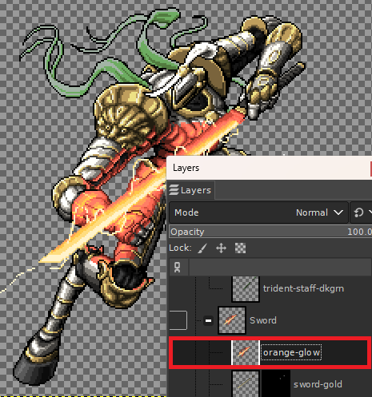
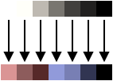
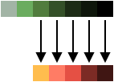
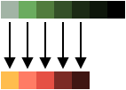

# Palette Swap

A GIMP Python plug-in for swapping the palettes of layers. Designed to work with sprite art with limited palette sizes, but not (yet) set to indexed colour profiles.

**Credits:** Sprites in the examples are from the incredible [Retrograde Minis](https://www.retrogrademinis.com/).

## Installation

Download the repository, and put the `palette_swap` directory in your GIMP plug-ins folder.
To find your plug-ins folder, see **Edit > Preferences > Folders > Plug-ins**. Then, select a folder and click the **Show file location in file manager** button on the right above the list.

## Usage

Two new options are added under **Colors > Map**:
* *Palette Swap...*
* *Palette Swap subset...*

### Palette Swap...

| Selecting plug-in | Selecting options |
| --- | --- |
|  |  |

The plug-in works on the current layer. It scans it and identifies the colours within it, then rank them by value (`red + green + blue`). You also select a 'sample' layer in the plug-in dialogue; this is also scanned for colours, which are ranked. This process may be slow for large layer sizes, as it checks the colour of every single pixel.

| Current Layer | Sample Layer |
| --- | --- |
|  |  |
| Extracted:  | Extracted:  |

> #### Simple Palettes
> If the selected layer is 1-pixel-high, the plug-in will use this as the palette
> instead of trying to extract the palette from the image. This means you can recolour
> to palettes without a constant increase in brightness!

Then, the plug-in will replace the lowest-ranked colour in the current layer with the lowest-ranked colour in the sample layer, then the second lowest with the second lowest, and so on.

If multiple colours have the same total value, the plug-in will fail as it cannot generate a unique map. If the number of colours in the two layers differs, only colours with a counterpart will be replaced. 

Then, with the map applied, you get your output:

| Map | Output |
| --- | --- |
|  |  |

### Palette Swap subset...

Works as above, with one difference - the plug-in asks for a palette to recolour, 
instead of determining it automatically from the current layer. This means you can have a layer with multiple sub-colours, and only re-colour a subset of them.

| Selecting plug-in | Selecting options |
| --- | --- |
|  |  |

The code goes through the layer in order of pixels, left from right, and takes it as the sample palette. This can be out of luminosity order.

| Subset Layer | Sample Layer | 
| --- | --- |
| Extracted:  | Extracted:  |

The code then just maps straight between the two palettes, without rearranging them. This means you can recolour both to *and* from a palette with non-increasing brightness. The map is applied, and then you get your output:

| Map | Output |
| --- | --- |
|  |  |

### Common Options

* *Whether or not to sample colours from transparent pixels.*
By default, the plug-in will include colours with full transparency (e.g. Alpha set to 0) when building up the colour profile for a layer. Set this to **No** to exclude these colours, and only include colours that are at least partially visible.

* *Go from the lightest to darkest instead.*
By default, the plug-in will pair up colours from the darkest to the lightest; if there are an uneven number of colours between layers, the lightest of the layer with the greater number will be ignored. Set this to **Yes** to pair up colours from the lightest to the darkest instead.

| Darkest first | Lightest first |
| --- | --- |
| **No** | **Yes** |
|  |  |
